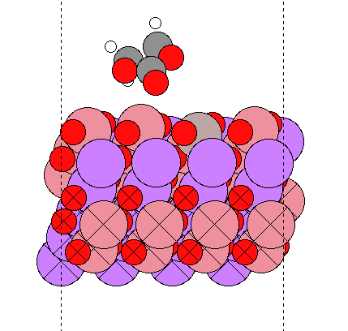
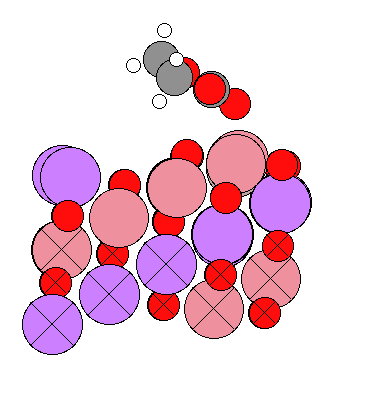
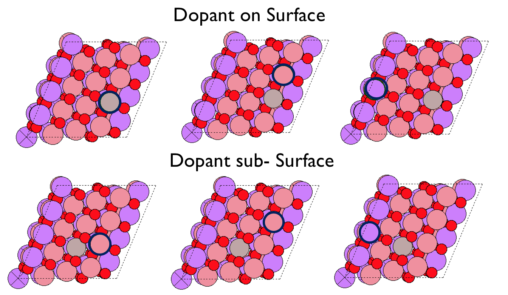
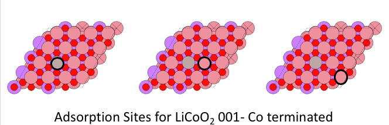
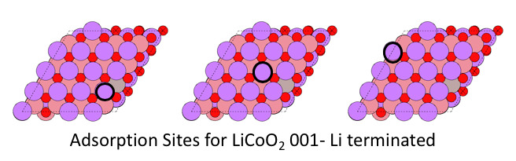

# ASE Tutorials
1. [Introduction to ASE](../)
2. [Getting Started with DFT Calculations](../Getting_Started/)
3. [Adsorption](../Adsorption/)

____

## Adsorption on LiCoO<sub>2</sub> ##

In the second exercise, you will be calculating the adsorption energy of a EC on the LiCoO<sub>2</sub>C surface and determining what the most favorable adsorption site is. The adsorption energy is defined as:
<div>

$$
\Delta E_\mathrm{ads} = E_\mathrm{surface + EC*}  - E_\mathrm{surface} - E_\mathrm{EC}
$$

</div>

where EC* refers to adsorbed EC. We have *E*<sub>surface</sub> from the previous exercise (the total energy of the previous slab so we will need to calculate *E*<sub>surface + N*</sub>. The energy of E<sub>EC</sub> is -61.76873529 eV which comes from a calculation that was previously done. 

<a name='adsorption-sites'></a>


### Python Script to add Adsorbate ###
Here is the python script we will use to add an adsorbate to our surface. This script reads in two files: bare.traj and EC.traj. EC.traj has been provided to you in the FinalProject directory. The bare.traj is going to be the surface you have constructed in your previous calculations. So in order to build this surface you must copy the fin.traj from Task 1 to the directory where you plan to run the adsorption DFT calculation. Also copy in EC.traj and the script you will need to submit your job (vasp-ase.sub and opt-ads.py). Next rename the fin.traj to bare.traj. In order to adsorb to the specified sites you must get the position of the atoms on the LiCoO<sub>2</sub> surface and alter the position=(XX,XX) accordingly. Next we need to specify the mol index of the atom we want to adsorb to this site so we will change mol_index = "INDEX of O atom in EC trajectory". This can be found by looking at the EC adsorbate through ASE.

```python
#!/usr/bin/env python

from ase import Atoms, Atom
from ase.calculators.vasp import Vasp
from ase.io import read,write
from ase.build import add_adsorbate,molecule

p=read('bare.traj')
EC =read('EC.traj')
add_adsorbate (p, h2o, height = 1, position = (3.429,22.484),mol_index=20)
write('init.traj',p)
```
Once we have changed the adsorption location and adsorption mol index we can run this script by `python add_ads.py` and we should generate a new trajectory called init.traj. This is going to be out initial trajecotry for our DFT calculation and should like something like this:

<center>
<br>
  Example of LiCoO<sub>2</sub> with an EC adsorbed
</center>

Please check to be sure that the adosrbate is a reasonable height above the surface. If not please change the height parameter in the add_ads.py script and re-run.

From here we can use our vasp-ase.sub script and opt-ads.py script to submit our job. (Change to final line in vasp-ase.sub to read python opt-ads.py and then submit through sbatch vasp-ase.sub). The resulting energy of this calculation is the E<sub>surface + EC*</sub> in the equation at the top of the page. You should already know E<sub>surface</sub> from your previous calculation and use E<sub>EC</sub> provided to get the adsorption energy. 


### Adsorption Sites ###

Here are the adsorption sites that must be investigated for this project.
 
<center><br>
Adsorbtion sites for 104 surface
</center>

<center><br>
Adsorbtion sites for 001 Co-terminated surface
</center>

<center><br>
Adsorbtion sites for 001 Li terminated surface
</center>


