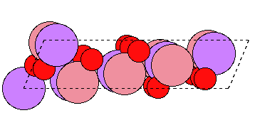
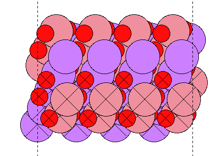
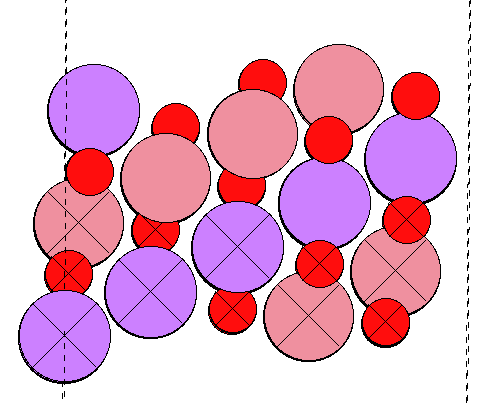
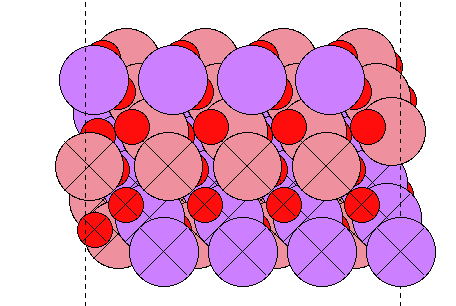

# ASE Tutorials
1. [Introduction to ASE](../)
2. [Getting Started with DFT Calculations](../Getting_Started/)

____

## Getting Started with DFT Calculations ##

In the first exercise, we will be studying lithium cobalt oxide; how to determine the lattice constants, followed by surface relaxation of the 104 surface. For Homework 5, everyone will be studying the same system (104) LiCoO<sub>2</sub>. For the Final Project, you will use the same system but with dopants on multiple facets (104 and 001) to study ethylene carbonate adsorption.

## Contents ##

1. [A Typical ASE Script](#a-typical-ase-script)
2. [Lattice Constant Determination](#lattice-constant-determination)
3. [Convergence with k-points](#convergence-with-k-points)
4. [Optimization](#optimization)


<a name='a-typical-ase-script'></a>

### A Typical ASE Script ###

ASE scripts can be run directly in the terminal (in the login node) or submitting to external nodes. Generally, you will be submitting jobs to external nodes and only small scripts will be run on the login node. By default, all output from any submitted script will be written *from the directory where the submission command was executed*, so make sure you are inside the calculation folder before running the submission command.

To start this tutorial and the exercises that follow, log on to Chestnut and download the following:
```bash
wget https://cbe544.github.io/CBE544-2019.github.io/HW.tar.gz
tar -zxvf HW.tar.gz
cd HW5
```

There are two files that are necessary to run jobs on the Chestnut cluster. The first is `vasp-ase.sub`; this is the file that tells the scheduler how much time the job is allowed, how many processors it requires, and other pertinent information. First, notice the comments in the beginning. These include information such as how much time to allocate, the number of nodes required, what the names of the output and error files are, what the name of the job should be, and what your email is. 

```bash
#!/bin/bash

#SBATCH -x node63,node64,node81                 #node to exclude due to problems. Do not change
#SBATCH -p p_alevoj                             #partition to run on. do not change
#SBATCH -N  2 #number of nodes
#SBATCH --tasks-per-node=32                     #do not change
#SBATCH -t 48:30:00 #time limit
#SBATCH -J JOBNAME #job name                    #Name your job here
#SBATCH -o out.%j #screen output                #output file name. %j is job number
#SBATCH -e err.%j #errinfo                      #err file name
#SBATCH --mail-user=EMAL@seas.upenn.edu         #add you email address here to be alerted when job ends
#SBATCH --mail-type=end #notify when job finishes #mail when job ends


#export VASP_GAMMA=true
module load ase-vasp/run        #load vasp and ase

python script-name.py   #name of script to run
```

Finally, the last line ```python script-name.py``` picks the script you want to run. Therefore, you need to change the name of the file depending on which script you are running. We will be using this script later in this section for performing calculations to compute the lattice constant of bulk LiCoO<sub>2</sub>. ALL SCRIPTS INVOLVING DFT CALCULATION MUST BE SUBMITTED WITH THE COMMAND `sbatch vasp-ase.sub` where the vasp-ase.sub script ends with `python script-name`. DO NOT SUBMIT A PYTHON SCRIPT THAT IS INTEDED TO DO DFT CALCULATION ON THE LOG IN NODE.


Let's look at how a typical ASE script is written. Open the [`relax.py`](energy.py) script. We import all the relevant ASE modules in for this calculation

```python
from ase import Atoms, Atom
from ase.calculators.vasp import Vasp
from ase.io import read,write
import numpy as np
```

`from ase.calculators import Vasp` imports the VASP calculator for the ASE interface, and `from ase.io import read, write` imports the read and write commands for trajectory files.

An existing trajectory can be read in:

```python
# read in the slab
slab = read('surface.traj')
```

Then, the VASP calculator is set up. All parameters related to the electronic structure calculation are included here. The following example shows typical parameters that we use in the group for LiCoO<sub>2</sub> calculations.

```python
calc = Vasp(prec='normal',	#scf accuracy
            encut=520,		#plane-wave cutoff
            xc='PBE',		#functional
            lreal='Auto',	#sampling space
            kpts=[4,4,1],	#kpoint sampling
            nsw = 99,		#max number of ionic steps
            ibrion = 2,		#ion iteration steps
            ispin = 2,		#spin polarized
            amix_mag = 0.800000,#mixing parameters
            bmix = 0.000100,
            bmix_mag= 0.000100,
            amix = 0.20000,
            sigma = 0.05000,	#smearing
            ediff = 2.00e-04,	#energy difference for scf convergence
            ediffg = -2.00e-02,	#force  cutoff for overall convergence
            algo ='fast',
            ismear = -5,	#smearing type
            nelm = 250,		#max number of electronic steps
            ncore = 16,
            lasph= True,
            ldautype = 2,	#Use Hubbard U
            lmaxmix = 4,
            lorbit = 11,
            ldau = True,
            ldauprint = 2,
            ldau_luj={'Co':{'L':2, 'U':3.32, 'J':0},
                      'Li':{'L':-1, 'U':0.0, 'J':0.0},
                      'O':{'L':-1, 'U':0.0, 'J':0.0}
                      },
            lvtot = False,
            lwave = False,
            lcharg = False,
	    gamma=True,		#center at gamma point
)
```

Finally, the VASP calculator is attached to the `slab` Atoms object, the energy calculation is ran, and the total energy of the system is output in the log file (defined in the `vasp-ase.sub` file above). 

Once the scripts and atoms object is set up you can submit a job, using:

```bash
sbatch vasp-ase.sub
```

#### Note about Running on Chestnut ####

The designated nodes for running on chestnut that we are allotted to sometimes have difficultly in parellelization. If you have a job runnig for longer than expect (20-30 mintues for lattice and kpoints) or about 3-4 hours for the relaxation please go to the directory of the job and type cancel your job by typing `scancel JOBID`. Your JOBID can be found by typing sq and it will be listed on the far left column. After this edit the line in your vasp-ase.sub script which read "#SBATCH -x node63,node64,node81" to say "#SBATCH -x node63,node64,node81,node56,node57,node62,node55,node54". Then resubmit your job. 


<a name='lattice-constant-determination'></a>

#### Lattice Constant Determination ####

Find the [`lattice-constant-a.py`](Lattice_Constant.py) script in the `lattice/a` folder. This script calculates the different energies of the system as a function of the lattice constant. Before you run this job, make sure you read the comments within to understand what it does.

The following lines have been added the the beginning of the script to vary to lattice size of the bulk LiCoO<sub>2</sub>. LiCoO<sub>2</sub> is symmetric in two directions therefore our a and b lattice constants are going to the same and both mus tbe changed at the same time. However the c lattice vector can be studied independent of a and b. In addition the unit cell is created on an angle. This can be seen in the b and c initial lattice parameters. 

```python
eps=0.03
a0=2.835
c0=4.71
a=[a0,0,0]
b=[a0/2,(a0/2)*np.sqrt(3),0]
c=[a0/2,a0/(2*np.sqrt(3)),c0]
for X in np.linspace(1-eps,1+eps,7):
	p=read('init.traj')
 	p.set_cell([[i*X for i in a],[j*X for j in b],c],scale_atoms=True)
```

Remember to change the script name to lattice-constant-a.py in the `vasp-ase.sub` file! Submit the script by running:

```bash
sbatch vasp-ase.sub
```

To proceed with writing this script, you will be modifying the example script provided here: [ASE-Equation of State](https://wiki.fysik.dtu.dk/ase/tutorials/eos/eos.html). Note that the sample script reads 5 configurations from the trajectory, but we have 7 in our calculations.  

The EOS module for ASE is only available in the new version of ase. In order to load this we must load ase/3.13.0 before running the script. This script can be run on the login node directly. To execute the script you have written, use the command:

```python
module load ase/3.13.0
python EOS-script.py
```

This will plot the volumes vs energies and print the volume that related to the minimum energy. The output plot (EOS.png) should show the fitted energies as a function of the volume, with the volume corresponding to the minimum and the bulk modulus displayed on the top. To get the a<sub>DFT</sub> lattice constant take this volume and use this equation:

a<sub>DFT</sub> = sqrt[{2*Volume}/{(4.71)*sqrt(3)}]

Repeat this process with the c lattice constant by going to the lattice/c directory and running the script there. The process for the EOS will be the same but to get the c lattice constant you must use this formula.

c<sub>DFT</sub> = sqrt[(Volume/6.959)<sup>2</sup>+1.4175<sup>2</sup>+0.818<sup>2</sup>]

These equations come from the angles of the unit cell. For more information on how these equations were derived look up R3̅m spacegroup or ask Anthony.

**HW 5:** Show your Python scripts for the EOS, Plot the Equation of State fits, and report the DFT lattice constants.

<a name='convergence-with-k-points'></a>

#### Convergence with k-Points ####
The first thing that should be done here is the resize our bulk LiCoO<sub>2</sub> to the appropriate lattice constants. To do this return to the HW5 directory. Here you should see a script called resize.py. Put your values of a and c in line marked with #DFT lattice constant obtained previously. You can then run the python script on the login node by using: `python ressize.py` 

This should create a file called `LiCoO2-bulk-opt.traj`. This is what we will use to make the surface and test the kpoints. 

Next, we will determine how well-converged the total energy is with respect to the number of k-points in each direction. You will be running the kptconv.py script in the k-points folder. Look through the script to understand what its doing. Run this script by submitting a job to an external node as discussed previously. Remember to change the name of the script to execute, in the vasp-ase.sub file. Upon completion, the script outputs a convergence plot and prints the total energies as a function of the k-points used in the calculation.

Note: There is a typo in the kpointconv.py script. It should read in LiCoO2-bulk-opt.traj. Please fix this before submission.

**HW 5:** Show the k-point convergence plot, your pick for the k-points, and your rationale.

#### Optimization ####
Finally, you will be performing a geometry optimization on the 104 surface of LiCoO<sub>2</sub>. We will use the LiCoO2-bulk-opt.traj to make the surface. To proceed look at the file `build-surface.py`. This script reads in the optimized bulk trajectory and creates the 104 surface repeated with 6 layers. To proceed look at the file `build-surface.py`. This script reads in the optimized bulk trajectory and creates the 104 surface repeated with 6 layers.

```python
from ase.io import read,write
from ase.build import surface,bulk
from ase import atoms
from ase.visualize import view

p=read('LiCoO2-bulk-opt.traj')	#bulk input
s1 = surface(p, (1,0,4), 6)     #type of surface you want
s1.center(vacuum=10,axis=2)	#center strucutre
write('LiCoO2-104.traj',s1)	#write trajectory
```
Similar to the EOS module the build module is also only available in ase/3.13.0. If you have left the terminal since the last time you loaded it you will need to reload it again before submitting the python script. This should go like this. 

```bash
module load ase/3.13.0
python build-surface.py
```
The resuting LiCoO2-104.traj should look something like this:
<center><br></center>


We need to finish building our surface by repeating it in the y direction and constraining the bottom 3 layers. We can do this in ASE-GUI. Open the file (`ase-gui LiCoO2-104.traj` or `ag LiCoO2-104.traj`) and use the Edit -> Repeat to repeat the unit cell 4 times in the y direction. Once it has repeated click the set unit cell button. Now we must constrain the bottom three layers of our LiCoO<sub>2</sub>. To do this select the atoms in the bottom three layers of our slab and go to Tools -> Constratints -> Constrain Selected Atoms. It is easy to tell which Li and Co are in the bottoms 3 layers but the Oxygen atoms may be confusing. Use the Figures below for reference to  constrain the correct rows of atoms. 

<center><br>
<br>
<br>
</center>

Once it has been repeated and constrained save this atoms object by File -> Save and name your file in the line as surface.traj. Copy this trajectory file to the relax directory. Next move into the relax directory and take a look at the `relax.py` script discussed previously. Please be sure that the relax script is reading in the proper trajecotry files. You will be using this script for running the surface optimization calculations. Submit the calcualtion using the vasp-ase.sub script and be sure to change the file name accordingly.

To check on the calculation while it is running use either 

```bash
more out.XXXXXX
````
or 
```bash
less out.XXXXX
```
Once the calculation is completed and you have recieved an email go to the relax directory. The final energy will be printed in the last line of the out.XXXXX file. To see this line use the command `tail out.XXXXX`. Tail will print out the last few lines of the file. You should see something like this:

```bash
Energy = -514.7679737
max_forces = 0.015439
```
Please be sure that the force is below the criteria set. The Energy listed is the energy of the system.

**HW 5:** Report the converged energy of the optimized structure. Comment on the surface changes of the final structure. 

