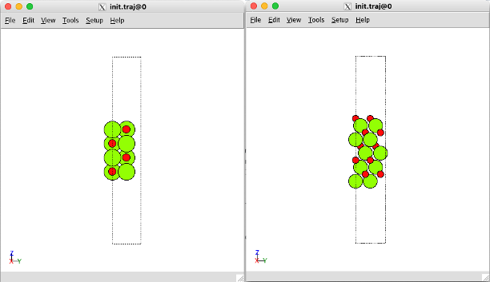

## Course Project ##


1. [Introduction](#intro)
2. [Alkaline Oxide](#MO)
3. [Silicate](#silicate)


For the Final Project, you will perform a comprehensive study on CO<sub>2</sub> adsorption on mineral surfaces and its transformation due to interaction with these surfaces. The students will be assigned into two groups. One group will study magnesium-based oxides and silicates, while the other group will study calcium-based oxides and silicates. Each group will present their results in class that will be critiqued by the other groups. Finally, each group will jointly write a final report on the combined data.


Turn in your final report by emailing a PDF file to:

```
alevoj@seas.upenn.edu, yingjies@seas.upenn.edu
```
<a name='intro'></a>

## Introduction ##

Goal: Determine the lowest CO<sub>2</sub> adsorption energies and the molecular configurations.

Plan: Use DFT to calculate CO<sub>2</sub> adsorption energies for each adsorption site and initial configuration (details are given below). Determine the molecular bond lengths and bond angle for each converged calculation. Plot the Density of States (DOS) of the configuration with the lowest adsorption energy. 

### Motivation ###

- In designing an efficient carbon mineralization material, knowing if it can uptake CO<sub>2</sub> is critial. In other word, we are urged to know if CO<sub>2</sub> can adsorb (adsorption thermodynamics) on it and react.
- Reactive magnesium oxide cement (RMC) is widely studied for carbon capture processes. Hydrated MgO has stronger abilities to adsorb CO<sub>2</sub> and produce carbonated products. We will determine the structure of hydrated MgO through analyzing the stability phase diagram that relates Gibbs free energy of dissociative particle adsorption to water derivative chemical potential (details will be given below).
- There are many possible bulk cleavage planes for MgO and CaO. The most studied ones are (100), (110), and (111). The stability of these facets varies greatly, leading to significantly different adsorption phenomena of CO<sub>2</sub> on different facets.
- Mg and Ca containing (alumino)silicates naturally exist in mine waste tailings. The use of these tailings is considered an alternative avenue for mineralization because they are an inherently cost-effective feedstock that could generate revenue in addition to captuing CO<sub>2</sub>. The presence of Si adds complexity to the study due to the different Si coordination numbers.
- When CO<sub>2</sub> is hydrated, it can undergo protonation/deprotonation through interaction with water to form charged intermediates depending on the solution pH. These species typically are HCO<sub>3</sub><sup>-</sup> and CO<sub>3</sub><sup>2-</sup>. This motivates us to study how these species interaction with mineral surfaces is differed from molecular CO<sub>2</sub>.
- Therefore, we will be studying the chemistry of carbon mineralization and down the line understanding how that chemistry changes with respect to the many factors, such as cation, facet, presence of water, Si coordination, pH conditon, etc.
  
<a name='MO'></a>

## Alkaline Oxide ##

This is part one of the final project. In this part, you will be studying your assigned MgO (or CaO) surface with appropriate facet and termination, including whether it is moisturized.

### Surface Facet (Cleavage Plane) ###

Both MgO and CaO are simple compounds with a cubic crystal. A surface facet is created by performing cleavage on a bulk material. The resulting faceted surface is denoted by the Miller indices, such as (100), (010), (211), etc. In general, we compare the cleavage energy density to determine whether a certain facet is stable relative to another. The calculation of the cleavage energy density is given as follows:

$$
\epsilon_{cleave}(i,j) = -\frac{1}{2A}(E_{slab}^{i}+E_{slab}^{j}-2E_{bulk})
$$

where $\epsilon_{cleave}(i,j)$ is the cleavage energy density and i, j are the indices for two complementary facet terminations (you will know this better later). $A$ is the surface area of a unit cell. Please DO NOT run jobs to calculate the cleavage energy density yourself, as we have only limited computational resources.


**Task 1: Create a surface off of bulk**

First, run the commands below to obtain the optimized bulk MgO and CaO structure and the script to create surfaces. Now that you are already familiar with Linux, you need to organize your workspace. Please feel free to create directories to make your life easier! Note you only need to run one line out of the first two lines below, depending on your assignment.

```
cp /home/x-syj1022/minerals/MgO/opt.traj ./
cp /home/x-syj1022/minerals/CaO/opt.traj ./
cp /home/x-syj1022/scripts/surface.py ./ 
```
Make sure you understand what the script does. You need to modify the line below based on the specific facet you are assigned to. Please check what your assignment is carefully. Here ``(1, 0, 0)`` is the target facet and ``2`` means you are making a four-layer slab (double the unit cell in z-direction). 

```
s1 = surface(bulk, (1, 0, 0), 2) #specify surface off of bulk
```

Note our goal is to create a 2x2x2 slab model. If you are working with (111) facet, please change this to:

```
s1 = surface(bulk, (1, 1, 1), 3) #specify surface off of bulk
```

You might be wondering why we specify the number of layers as ``3`` not ``2`` here, but you will know why soon. Then please make sure you add vacuum space in z-direction. This is done by the code:

```
s1.center(vacuum=11, axis=2) #speficy vacuum dimension and axis
```

After you have run ``python surface.py`` and check it through ``ase gui init.traj``, you should be able to see structures exactly as shown below. Note this is a side view - press `X` to view from the side. If you work with (100) facet, please compare with the bottom left image, and if you work with (111) facet, please compare with the bottom right image.

<center><br>

If you work with (100) facet, you may ignore this step, because (100) facet is perfectly symmetric from top to bottom. If you work with (111) facet, you will see you are actually assigned with either (111)-M or (111)-O. This denotes the termination - your surface can either end with metals or oxygens. You need to do one step further to make sure you have the correct facet termination. Recall I previously asked you to add one additional layer. Now this makes it easier for you to trim the structure. You might need some intuition on how to do this, but if you feel lost, follow these instructions: If you work with (111)-M, please remove the entire top layer of oxygens and the entire bottom layer of metals. If you work with (111)-O, please remove the entire bottom layer of metals and the entire bottom layer of oxygens. Once you finish, check the total number of atoms. There must be eight metals and eight oxygens.

Now remember we need a 2x2x2 slab model, but our current model is 1x1x2. To repeat the cell in both x and y directions, go to `View` then `Repeat` and set to the correct values. Next, hit the `Set unit cell` button. Double check if your cell is actually doubled in both directions. Finally, select the entire two bottom layers (this should be half of your entire cell), and go to `Tools` -> `Constraints` -> `Fix`. You should see a "cross" symbol on every atom you selected. This means we are contraining the bottom two layers to their bulk lattice coordinates and only allowing the top two layers to relax.

Always remember to save your `.traj` file!

Once you finish setting up the surface, please check with me. You need my permission to move on from here.


**Task 2: Add moisture components to your surface**

You do not need to work on this part if you are not assigned with an moisturized surface. HOWEVER, everyone needs to read and understand the instructions below, as everyone will work with moisturized surface in part 2 of the final project.

`Add stability phase diagram here`

As we can imagine, when water interacts with the surfaces, it might also adsorb with its molecular form or dissociative adsorb in which case it breaks down into hydrogen and hydroxide. These particles play very important roles in boosting carbonation proccesses. But first thing first, we need to investigate if they favor retaining on the mineral surfaces. To find out, Colin and I have constructed these stability phase diagrams. Here, you are only responsible for being able to intrepret from the diagrams. If you are interested in how to derive the equations leading to the diagrams, we can discuss later. In these diagrams, the black dashed line falls on the saturation chemical potential of water. This means water reaches an equilibrium between liquid and gaseous phase at this chemical potential. Right to the line means water can condense as a liquid and left to the line means water is in its vapor phase. Base on your knowledge of thermodynamics, identify the most stable (likely) hydrated surfaces and add these particles to your structure.

To simplify your work, I have provided you with an automation script `auto_ads.py`. You may use the alias `ads` as a shortcut to run this script. Note by our convention, we only adsorb `OH` on the metals and `H` on the oxygens.

**Task 3: CO<sub>2</sub> adsorption**

As we have briefly touched on in HW5, the CO<sub>2</sub> adsorption can take place on many sites in addition to the lattice oxygen, and the CO<sub>2</sub> molecule can line up differently. To comprehensively walk through the many different possibilites, please follow the diagrams I made as shown below. The original paper can be found here.

Recall you have manually added a CO<sub>2</sub> molecule on the MgO (100) surface in HW5. Now, to reduce human error, I have prepared automation scripts for you. For adsorption on metal sites and oxygen sites, please use `CO2_M_ads.py`. For adsorption on M-O bond, please use `CO2_MO_ads.py`. For adsorption on the four-fold center, please use `CO2_center_ads.py`. Note, these scripts are only for adding molecular CO<sub>2</sub>. However, all of you will be working with HCO<sub>3</sub><sup>-</sup> or CO<sub>3</sub><sup>2-</sup>. Please copy these scripts to your directory and make changes in accordance. Note this is the hardest part of the final project and needs a lot of geometry math work. Please feel free to ask for my help on this part.

**Task 4: SCF calculations**

The calculated adsorption energy comes from both the surface relaxation and CO<sub>2</sub> adsorption energy costs. However, our interest is the adsorption energy, thus we need to eliminate the effect of surface relaxation. To do this, you want to remove the CO<sub>2</sub> from the converged structure and perform an SCF calculation. For each of the completed relaxation calculation, you can run `python pwlog.py` to get a `rlx.traj`. Make a directory and store the `rlx.traj`. Go to the directory and type `scf` that calls the alias to automatically perform the atom deletion and job submission.

**Task 5: Density of States (DOS) calculations**

Once you have gone through all the calculations on different adsorption sites and obtained the adsorption energies. Find the one with the lowest energy and run the DOS calculation on it. 

**Task 6: Report DOS, final bond angles, bond lengths, and any abnormal phenomena**

Plot DOS as what you have done in HW5. You can visually check to get the bond angles and bond lengths from `rlx.traj`. You may want to report any abnormal phenomena over the course of relaxation. These can include but not limited to bond break within CO<sub>2</sub>, bond reformation, and severe surface reconstruction.


<a name='silicate'></a>

## Silicate ##

This is part two of the final project. In this part, you will be studying your assigned silicate (forsterite, enstatite, larnite, wollastonite) surface with appropriate facet and termination, including whether it is moisturized.

Although MgO and CaO are chemically the simpliest minerals for carbonation, you have already seen the thorough investigation of surface CO<sub>2</sub> adsorption is rather demanding. As we delve into more complex and asymmetric surfaces, the calculations that need to be done are skyrocketing. For example, the image below shows the carbonation sites to be considered on larnite (100) surface for a complete analysis. For each larnite unit cell, there are four unique calciums and six oxygens exposed, whereas there are only one unqiue calcium and one oxygen in CaO. To fully cover every single site as what we have done for MgO and CaO, it requires 20 times as much as our previous work! Of course, the computational resources don't allow us to do this. Instead, we are going to start with focusing on the oxygen sites only. Also, we are only going to consider the molecular CO<sub>2</sub>.

